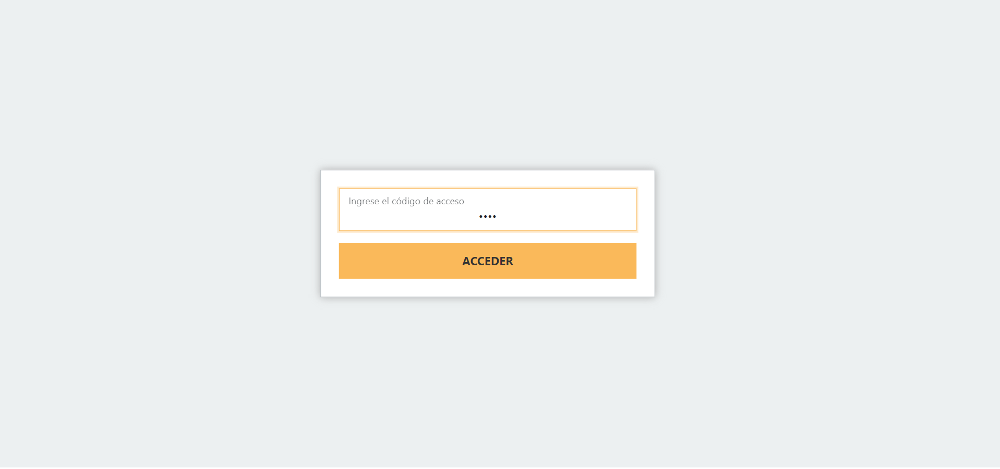
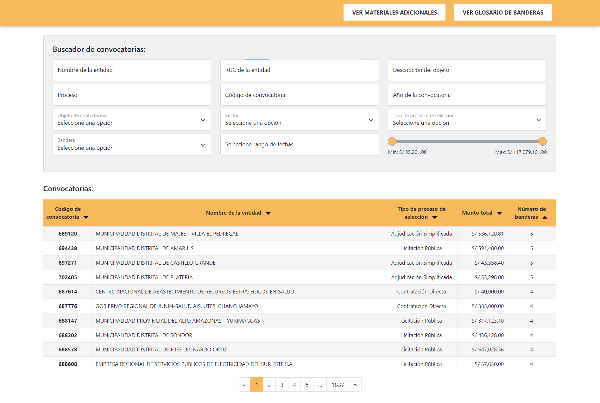
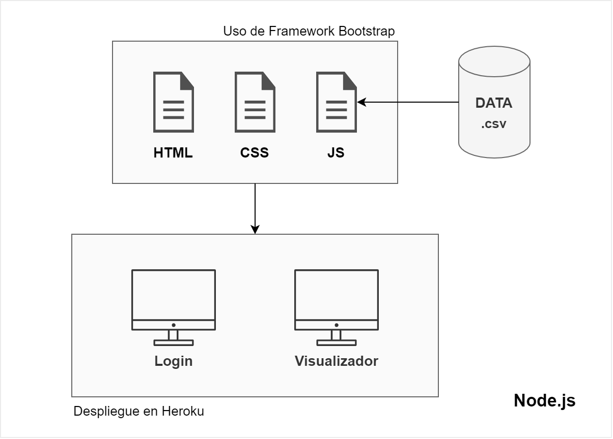

# Desarrollo del visualizador

## Descripción del proyecto 

El proyecto involucró un análisis constante de la necesidad presentada por el cliente; por tanto, la solución es a medida. Ante esta premisa, los desafíos que involucraron el resultado obtenido ha conllevado el planeamiento de una arquitectura de software que se adapte a la etapa previa del análisis de datos y a la proyección de estos datos en una plataforma amigable e intuitiva. 

 

**Figura 1:** Login para acceder al visualizador

 

**Figura 2:** Visualizador

 

## Arquitectura del Proyecto 

### Entorno de trabajo 

El ordenador utilizado para el desarrollo de la solución tiene las siguientes características: Sistema operativo Windows 10, Intel Core i7. Los programas utilizados: Excel, PowerPoint, Visual Studio Code, Google Chrome. El lenguaje de programación utilizado: JavaScript. Así también, fue necesario el uso de HTML y CSS para la generación de la solución Node.js.  

 

### Etapa de formato a la data recibida 

Como se menciona en la descripción del proyecto, la data utilizada en el proyecto proviene de un análisis de datos previo. La data obtenida, fue recibida en formato Microsoft Excel Worksheet (.xlsx). Posteriormente a la recepción, se procedió a homogeneizar los encabezados de las tablas, ello involucró agregar o retirar símbolos. Continuando, se exporta el archivo en una versión Microsoft Excel Comma Separated Values File (.csv), para este propósito se configuró el software y el ordenador para que permita utilizar otro símbolo como elemento de separación, se utilizó el símbolo hash “#”. Hay que recordar que el símbolo convencional en una conversión de archivo .xlsx a .csv, es la coma “,”. El requisito para elegir el símbolo de separación dependerá de la data que trae el archivo original, se debe emplear uno que no se incluya en el archivo. 

 

### Etapa del desarrollo de la solución 

Como se mencionó en el punto 1, la solución generada es en Node.js. Las herramientas de codificación utilizadas involucran el uso de HTML para la estructura del contenido del sitio web, el uso de CSS para añadir los estilos y finalmente, el uso de JavaScript permitió la implementación de las diversas funcionalidades que encontramos en la solución. Como resultado obtendremos dos vistas, el primero del login y el segundo del visualizador. El uso de Node.js tiene el propósito de no tener la necesidad de exponer la clave de acceso al login de forma explícita. Es decir, la clave de acceso se encontrará de forma segura en un espacio fuera del proyecto, en un entorno de Heroku. 
El archivo .CSV descrito en el punto 2 se invocará en el proyecto, nos apoyaremos en el lenguaje de programación JavaScript para este propósito. De esta manera, permitirá representar el desglose de su contenido en el sitio web. La estructura desarrollada para cada bandera dependerá del contenido que viene en la data.  

En el archivo HTML se vinculará la fuente de Google que se empleará, se vinculará de la misma manera los estilos CSS propios al desarrollo de la solución como los que se incorporan del framework Bootstrap. Nos apoyaremos en Bootstrap para generar una estructura de forma más rápida y reutilizando funcionalidades. 

En el archivo CSS se insertarán los estilos como la definición de la fuente, tamaños de las letras, disposición de espacios entre los elementos y la incorporación de los colores acorde a los analizados en las plataformas del cliente. 

Como resumen, el uso de Excel es vital para obtener el archivo que insertaremos en el proyecto. El uso de PowerPoint es útil debido a que es la fuente de la información tras los talleres que se llevaron en diferentes sesiones con el cliente y tiene como fuente de información la descripción de las banderas y sus metodologías aplicadas. Visual Studio Code es la herramienta principal que permitió el desarrollo de la solución y facilita la escritura de código y juntamente con las extensiones propias del software facilitó por ejemplo el despliegue del proyecto en un servidor local. Así también, la consola de comandos utilizado es la que provee Visual Studio Code. Finalmente, el uso de Google Chrome refleja los cambios ingresados por código y haciendo uso del inspector del navegador, facilitó la adaptación de los cambios y ajustes en la aplicación. 

 

**Figura 3:** Esquema de la solución